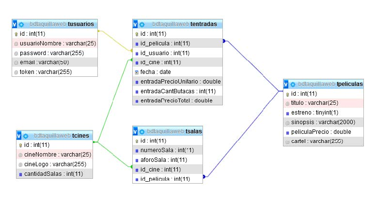

# Práctica final de Ciclo DAW. Aplicación TaquillaWeb

### Contenido del repositorio:
* **figurasREADME** - Contiene las imágenes que aparecen en README.md
* **figurasTW** - Contiene las imágenes referenciadas en la base de datos.
* **taquillaweb_react** - Aloja todo el código fuente de la parte cliente.
* **taquillawebAPI** - Contiene los archivos necesarios para el funcionamiento de la App en el servidor Django.
* **bdtaquillaweb.sql** - Es el archivo de la base de datos que está alojada en el servidor.
* **Capturas TaquillaWeb ...** - Archivos con capturas de pantalla de la aplicación en funcionamiento según fecha.
* **TaquillaWeb_wireframe** - Esquemas iniciales de la aplicación
---
---

## 1. Finalidad y funcionamiento de TaquillaWeb

Esta práctica final de ciclo consiste en la realización del frontend para la aplicación **TaquillaWeb**.

El backend que le da soporte está previamente realizado y para la entrega de este ejercicio solo se han modificado algunas respuestas del servidor con el fin de permitir una mejor manipulación de las mismas en la parte cliente.

El fin de TaquillaWeb es permitirle al usuario inspeccionar la cartelera que ofrecen los cines que hacen uso de la aplicación y, si lo desea, comprar las entradas para la película y el cine elegidos.

Se permite el acceso libre a las páginas Presentación y Descripción del código. El acceso al resto de funcionalidades solo está permitido con el registro previo del usuario.

## 2. Parte cliente

La aplicación está hecha con **React JS** y las páginas realizadas son las siguientes:

### 2.1. Páginas de acceso libre:
* Presentación (Inicio)
* Descripción del código
* Registro nuevo usuario
* Abrir sesión

### 2.2. Páginas de acceso limitado a usuarios registrados:
1. Presentación (como usuario registrado)
2. Página de Exploración con enlaces a las siguientes:
      * Todas las películas
      * Estrenos
      * Buscador
      * Películas por cine, con enlace a:
        * Compra de entradas
3. Cerrar sesión

## 3. Parte servidor

La aplicación hace uso de un servidor local **Django** en **http://localhost:8000** donde se gestionan las peticiones a los diferentes endpoints.
En este servidor se encuentra la base de datos en MariaDB **taquillawebbd.sql** obtenida a partir de la importación de **bdtaquillaweb.sql** original, realizada usando phpMyAdmin

### 3.1. Base de datos

La base de datos consta de 5 tablas:
* tusuarios
* tcines
* tSalas
* tpeliculas
* tentradas

Esquema relacional:

### 3.2. Reseña de los endpoints

| Funcionalidad | Nº endpoint y tipo | Endpoint |
| -- | -- | -- |
| Registro nuevo usuario | Endpoint 1 (POST /users)                 | http://localhost:8000/users/ |
| Login de usuario       | Endpoint 2 (POST /sessions)              | http://localhost:8000/sessions/ |
| Todos los cines        | Endpoint 3 (GET /cines/)                 | http://localhost:8000/cines/ |
| Todas las películas    | Endpoint 4 (GET /peliculas/)             | http://localhost:8000/peliculas/ |
| Película por su id     | Endpoint 5 (GET /peliculas/\<id>)         | http://localhost:8000/peliculas/\<id> |
| Películas por cine     | Endpoint 6 (GET cines/\<id>/peliculas)    | http://localhost:8000/cine/\<id>/peliculas/ | 
| Películas en estreno   | Endpoint 7 (GET /peliculas/estrenos)     | http://localhost:8000/peliculas/estrenos/ |
| Comprar entradas       | Endpoint 8 (POST /entradas/)             | http://localhost:8000/entradas/ |
| Buscador               | Endpoint 9 (GET /buscar_pelicula/\<cadena_solicitada>/) | http://localhost:8000/buscar_pelicula/\<cadena_solicitada>/ |

